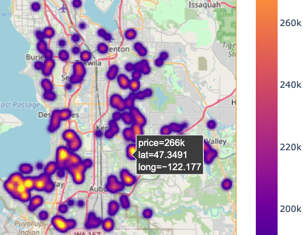

# Neue Fische Housing EDA

 

This project is part of Neue Fische Data Science Bootcamp EDA lessons. It is centered around exploratory data
analysis techniques and presentation of results to a client.

Assignment & further specifications can be found [here](assignment.md).

#### Choosen Persona is

| Name                | client | Characteristics                                                                                                                                                                 |
| ------------------- | ----------- | ------------------------------------------------------------------------------------------------------------------------------------------------------------------------------- |
| Thomas Hansen       | Buyer       | 5 kids, no money, wants nice (social) neighborhood, Timing?, Location?


For detailed infos about the EDA itself please check this [jupyter notebook](EDA.ipynb). Summary about the project and results can be found on this [pdf slides](neuefische_eda_project_wanchai.pdf).

Additional files that has been provided in order to complete project task are:

- [this jupyter notebook](1_Fetching_the_data_eda.ipynb) to import required dataset from external sql database
- These [column names](column_names.md) provide more details about extracted dataset.


## Requirements

- pyenv
- python==3.9.8

## Setup

One of the first steps when starting any data science project is to create a virtual environment. For this project you have to create this environment from scratch yourself. However, you should be already familiar with the commands you will need to do so. The general workflow consists of... 

* setting the python version locally to 3.9.8
* creating a virtual environment using the `venv` module
* activating your newly created environment 
* upgrading `pip` (This step is not absolutely necessary, but will save you trouble when installing some packages.)
* installing the required packages via `pip`

At the end, you want to make sure that people who are interested in your project can create an identical environment on their own computer in order to be able to run your code without running into errors. Therefore you can create a `requirements file` and add it to your repository. You can create such a file by running the following command: 

```bash
pip freeze > requirements.txt
```

*Note: In rare case such a requirements file created with `pip freeze` might not ensure that another (especially M1 chip) user can install and execute it properly. This can happen if libraries need to be compiled (e.g. SciPy). Then it also depends on environment variables and the actual system libraries.*

### Unit testing (Optional)

If you write python scripts for your data processing methods, you can also write unit tests. In order to run the tests execute in terminal:

```bash
pytest
```

This command will execute all the functions in your project that start with the word **test**.


### Environment

This repo contains a requirements.txt file with a list of all the packages and dependencies you will need. Before you install the virtual environment, make sure to install postgresql if you haven't done it before.

```bash
brew update
brew install postgresql
```

In order to install the environment you can use the following commands:

```
pyenv local 3.9.8
python -m venv .venv
source .venv/bin/activate
pip install --upgrade pip
pip install -r requirements.txt
```